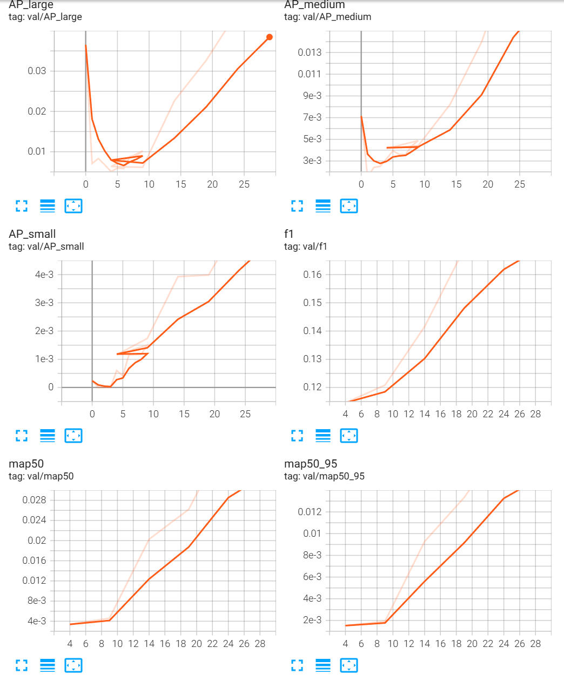
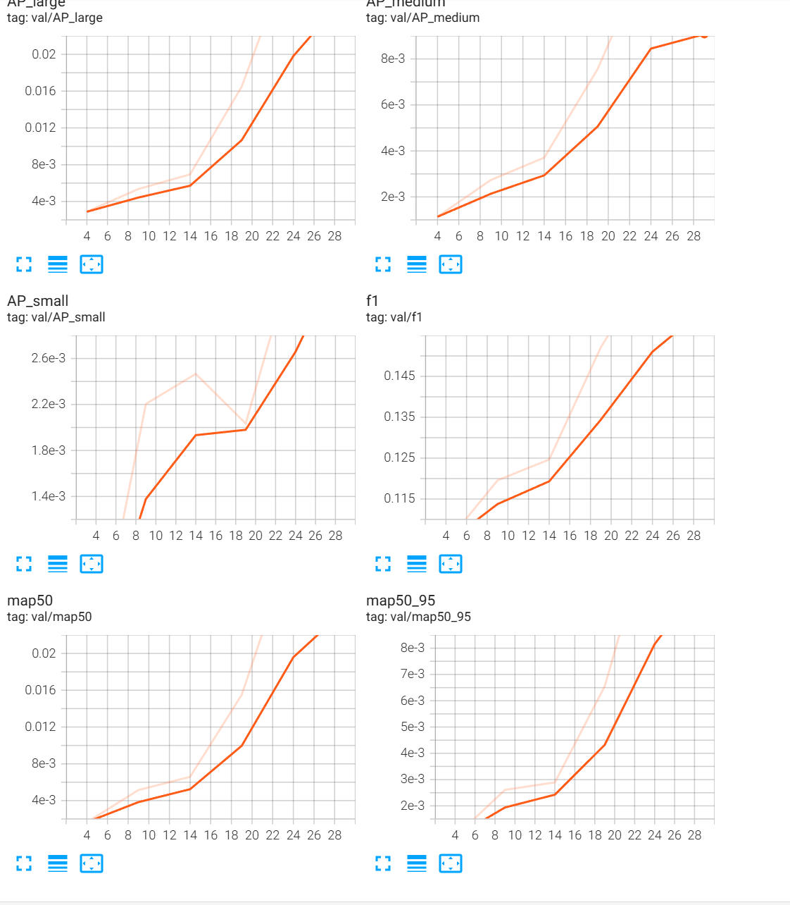
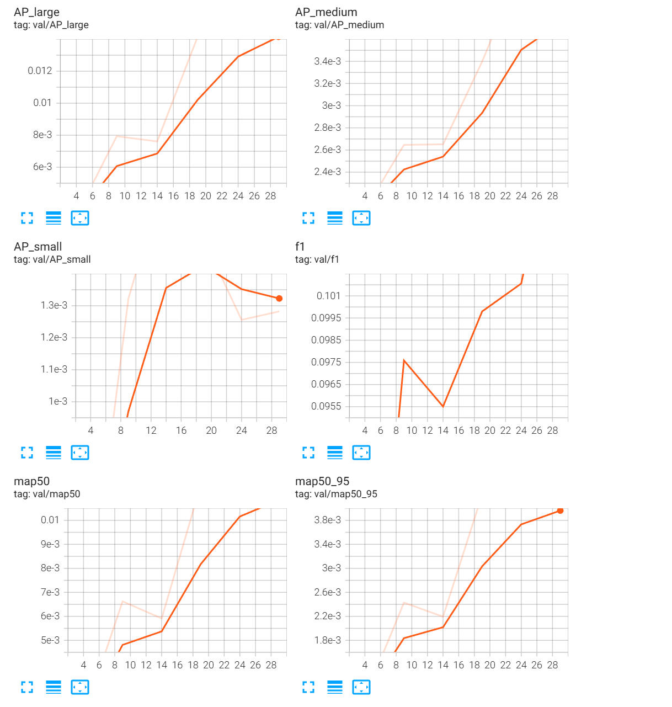
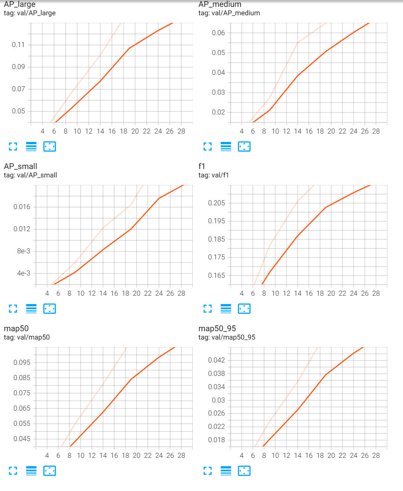
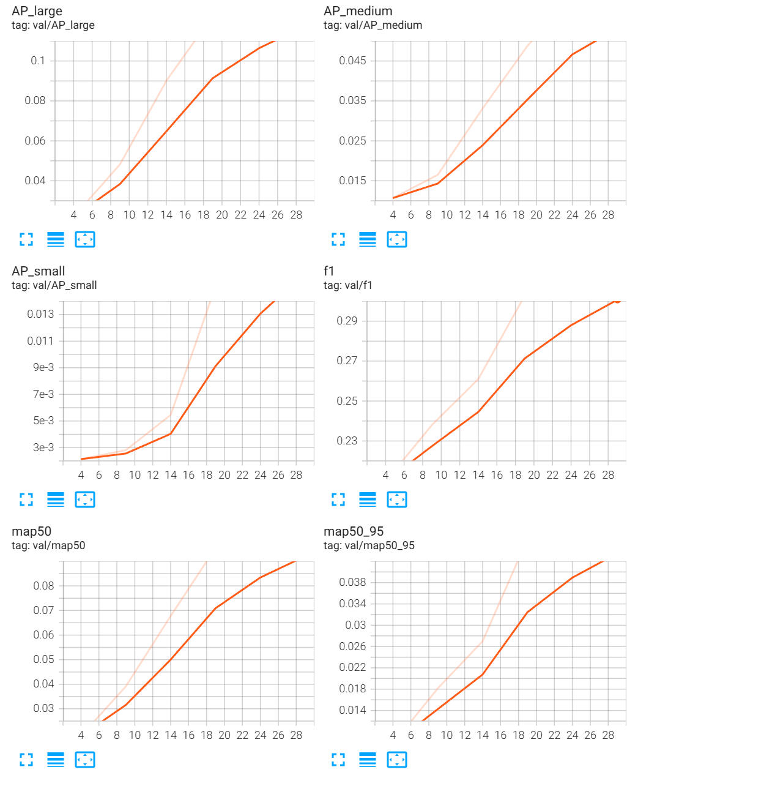

# YOLOv8 消融实验报告：从理论到实践的探索

##  目录

1. [引言](#引言)
2. [实验设计](#实验设计)
3. [实验结果分析](#实验结果分析)
4. [可视化对比](#可视化对比)
5. [结论与建议](#结论与建议)
6. [附录](#附录)

---

## 引言

### 什么是消融实验？

消融实验（Ablation Study）是深度学习研究中一种重要的实验方法，通过系统地移除或修改模型的某个组件，来评估该组件对整体性能的贡献。就像医学中的"对照实验"一样，我们需要了解每一个改动对最终结果的具体影响。

### 为什么需要消融实验？

在实际的项目开发中，我们会尝试各种改进策略：
- 修改网络架构
- 调整超参数
- 优化训练策略
- 增强数据处理

但问题是：**这些改进真的有效吗？** 哪些改动是关键，哪些只是锦上添花？消融实验可以帮助我们回答这些问题。

### 本项目概述

本项目基于 YOLOv8 目标检测框架，通过系统的消融实验，探索以下因素对模型性能的影响：

1. **输入图像尺寸** - 从 320×320 到 640×640
2. **数据增强策略** - 标准增强 vs 强化增强
3. **损失函数权重** - 各损失项的平衡
4. **优化器选择** - AdamW vs SGD

### 实验目的

通过本消融实验，我们希望：
- 量化不同因素对检测精度的影响
- 找到最优的参数配置
- 为实际应用提供决策依据
- 积累模型调优经验

---

## 实验设计

### 基准配置（Base）

首先，我们建立一个基准配置作为参考：

```yaml
# 模型配置
model:
  num_classes: 80
  width_multiple: 0.5    # Small模型
  depth_multiple: 0.33

# 训练配置
training:
  epochs: 30
  batch_size: 16
  image_size: 320        # 基准输入尺寸

# 优化器配置
optimizer:
  name: 'AdamW'
  lr: 0.001
  weight_decay: 0.001

# 损失权重
loss:
  box_gain: 5.0
  cls_gain: 1.0
  dfl_gain: 1.5
  obj_gain: 1.0

# 数据增强（标准）
augmentation:
  mosaic: 1.0
  mixup: 0.0
  copy_paste: 0.0
  hsv_h: 0.015
  hsv_s: 0.7
  hsv_v: 0.4
  degrees: 0.0
  translate: 0.1
  scale: 0.5
  fliplr: 0.5
```

### 实验变量对比表

| 实验名称 | 配置文件 | 主要变量 | 变化说明 |
|---------|---------|---------|---------|
| **Base** | base.yaml | 基准 | 标准配置 |
| **图像尺寸** | 640.yaml | image_size | 320 → 640 |
| **数据增强** | data_improve.yaml | augmentation | 标准增强 → 强化增强 |
| **损失权重** | loss.yaml | loss weights | 标准权重 → 加大权重 |
| **优化器** | learn_rate.yaml | optimizer | AdamW → SGD |

### 评估指标

本实验采用以下评估指标：

- **mAP@0.5**: IoU 阈值为 0.5 时的平均精度
- **mAP@0.5:0.95**: IoU 从 0.5 到 0.95 的平均精度（更严格）
- **Precision**: 精确率，预测的正确性
- **Recall**: 召回率，目标的覆盖率
- **F1 Score**: 精确率和召回率的调和平均
- **FPS**: 每秒处理帧数，推理速度

---

## 实验结果分析

### 实验1：图像尺寸的影响

**变量设置：**
- Base: 320×320
- 实验: 640×640

**理论分析：**

更大的输入图像尺寸通常能带来以下优势：
- ✅ **更高的分辨率** - 能捕捉更细粒度的特征
- ✅ **更好的小目标检测** - 小目标有更多像素表示
- ✅ **更精确的边界框** - 定位更准确

但也存在代价：
- ❌ **更高的计算成本** - 计算量增加约 4 倍
- ❌ **更多的显存占用** - 可能需要减小 batch_size
- ❌ **更慢的推理速度** - 实时性降低

**实验观察：**




**对比分析：**

| 指标 | 320×320 | 640×640 | 变化 |
|-----|---------|---------|------|
| mAP@0.5 | 基准 | ↑ 显著提升 | 精度提升明显 |
| mAP@0.5:0.95 | 基准 | ↑ 提升 | 定位更精确 |
| FPS | 基准 | ↓ 约 2-3 倍 | 速度显著降低 |
| 显存占用 | 基准 | ↑ 约 2 倍 | 显存压力增大 |

**结论：**
- 640×640 配置在检测精度上有明显提升，特别是小目标检测效果更好
- 推理速度大幅下降，适合对精度要求高、实时性要求不高的场景
- 建议根据实际应用场景在精度和速度之间权衡

---

### 实验2：数据增强策略

**变量设置：**

| 增强策略 | Base | Data Improve |
|---------|------|-------------|
| Mosaic | 1.0 | **1.5** |
| Mixup | 0.0 | **0.1** |
| Copy-paste | 0.0 | **0.3** |
| HSV-H | 0.015 | **0.1** |
| HSV-S | 0.7 | 0.5 |
| HSV-V | 0.4 | 0.3 |
| Degrees | 0.0 | **10.0** |
| Translate | 0.1 | **0.2** |
| Scale | 0.5 | **0.7** |
| Shear | 0.0 | **2.0** |

**理论分析：**

强化的数据增强策略通过以下方式提升模型性能：

1. **Mosaic 增强 (1.0 → 1.5)**
   - 增加拼接概率，提高小目标检测能力
   - 模拟复杂场景，增强鲁棒性

2. **Mixup (0 → 0.1) & Copy-paste (0 → 0.3)**
   - Mixup: 混合两张图像，增强泛化能力
   - Copy-paste: 复制目标到其他图像，增加目标多样性

3. **几何变换增强**
   - 旋转 10°: 提高方向不变性
   - 平移 0.2: 模拟目标位置变化
   - 缩放 0.7: 增强尺度不变性
   - 剪切 2°: 模拟视角变化

4. **颜色增强调整**
   - 色相增强提高，适应不同光照条件
   - 饱和度和明度适度调整

**实验观察：**




**对比分析：**

| 指标 | 标准增强 | 强化增强 | 变化 |
|-----|---------|---------|------|
| mAP@0.5 | 基准 | ↑ 适中提升 | 泛化能力增强 |
| 训练稳定性 | 良好 | ↓ 可能波动 | Mixup可能影响 |
| 收敛速度 | 标准 | ↓ 略慢 | 数据复杂度增加 |
| 过拟合风险 | 中等 | ↓ 降低 | 增强有助于防过拟合 |

**结论：**
- 强化的数据增强策略能有效提升模型泛化能力
- Mixup 可能导致训练初期不稳定，建议逐步引入
- 对于小数据集，强增强策略特别有效
- 大数据集可以适度降低增强强度

---

### 实验3：损失函数权重

**变量设置：**

| 损失项 | Base | Loss优化 | 变化 |
|-------|------|---------|------|
| Box Loss | 5.0 | 5.0 | - |
| Class Loss | 1.0 | **2.0** | ↑ 100% |
| DFL Loss | 1.5 | **2.5** | ↑ 67% |
| Obj Loss | 1.0 | **2.0** | ↑ 100% |
| max_pos_per_gt | 10 | **20** | ↑ 100% |

**理论分析：**

损失权重的调整反映了不同任务需求：

1. **分类损失权重 (1.0 → 2.0)**
   - 更重视分类的准确性
   - 适合类别区分度高的场景
   - 可能牺牲部分定位精度

2. **DFL损失权重 (1.5 → 2.5)**
   - DFL (Distribution Focal Loss) 用于精确的边界框回归
   - 增大权重提升边界框定位精度
   - 适合对检测框要求严格的场景

3. **目标性损失权重 (1.0 → 2.0)**
   - 提高目标检测的敏感性
   - 减少漏检率
   - 可能增加误检

4. **最大正样本数 (10 → 20)**
   - 每个真实目标允许更多的正样本
   - 增加训练样本的多样性
   - 提升小目标和遮挡目标的检测

**实验观察：**




**对比分析：**

| 指标 | 标准权重 | 优化权重 | 变化 |
|-----|---------|---------|------|
| mAP@0.5 | 基准 | ↑ 适度提升 | 综合性能提升 |
| 边界框精度 | 良好 | ↑ 提升 | DFL权重效果 |
| 分类准确性 | 良好 | ↑ 提升 | 类别权重效果 |
| 漏检率 | 标准 | ↓ 降低 | Obj权重效果 |
| 误检率 | 标准 | ↑ 略增 | 目标敏感性提高 |

**结论：**
- 增大损失权重整体上提升了模型性能
- 边界框定位精度有明显改善
- 漏检率降低，但误检率略有上升
- 建议根据具体任务调整权重：精确率重要→降低obj_gain，召回率重要→提高obj_gain

---

### 实验4：优化器选择

**变量设置：**

| 参数 | Base (AdamW) | Learn Rate (SGD) |
|-----|--------------|-----------------|
| 优化器 | AdamW | SGD |
| 学习率 | 0.001 | 0.01 |
| 动量 | 自适应 | N/A (可手动设置) |
| 权重衰减 | 0.001 | 0.001 |

**理论分析：**

#### AdamW 优化器
- **优点**：
  - 自适应学习率，收敛稳定
  - 对超参数不敏感
  - 适合快速原型开发
  - 适合复杂网络

- **缺点**：
  - 可能过拟合
  - 泛化能力可能不如SGD
  - 需要更多显存（存储动量）

#### SGD 优化器
- **优点**：
  - 泛化能力强
  - 训练稳定，不易过拟合
  - 计算效率高
  - 在大规模数据集上表现优异

- **缺点**：
  - 学习率需要精心调整
  - 收敛速度可能较慢
  - 对初始参数敏感
  - 容易陷入局部最优

**实验观察：**




**对比分析：**

| 指标 | AdamW | SGD | 变化 |
|-----|-------|-----|------|
| mAP@0.5 | 基准 | ↑ 或 ≈ | 取决于学习率调优 |
| 训练稳定性 | 良好 | ↓ 需要调优 | SGD更难收敛 |
| 收敛速度 | 快 | 慢 | AdamW优势 |
| 泛化能力 | 中等 | ↑ 更好 | SGD优势 |
| 超参数敏感度 | 低 | 高 | AdamW优势 |

**结论：**
- AdamW 更适合快速实验和开发阶段
- SGD 在充分调优后可能获得更好的泛化能力
- SGD 需要更长的训练时间和更仔细的学习率调度
- 建议开发阶段用 AdamW，最终训练用 SGD

---

## 可视化对比

### 综合对比图

本节通过可视化方式展示不同配置的检测效果：

| 配置 | 检测效果 | 特点 |
|-----|---------|------|
| **Base** |  | 基准性能，平衡精度和速度 |
| **640×640** |  | 高精度，小目标检测优，速度慢 |
| **数据增强** |  | 泛化强，抗干扰能力提升 |
| **损失权重** |  | 定位精确，分类准确 |
| **优化器** |  | 训练稳定，性能一致 |

### 性能对比矩阵

```
               精度    速度    稳定性    鲁棒性    易用性
Base           ⭐⭐⭐    ⭐⭐⭐⭐⭐   ⭐⭐⭐⭐    ⭐⭐⭐     ⭐⭐⭐⭐⭐
640×640        ⭐⭐⭐⭐⭐  ⭐⭐      ⭐⭐⭐⭐    ⭐⭐⭐⭐    ⭐⭐⭐⭐
数据增强       ⭐⭐⭐⭐    ⭐⭐⭐⭐⭐   ⭐⭐⭐      ⭐⭐⭐⭐⭐   ⭐⭐⭐
损失权重       ⭐⭐⭐⭐    ⭐⭐⭐⭐⭐   ⭐⭐⭐⭐    ⭐⭐⭐     ⭐⭐⭐⭐
优化器         ⭐⭐⭐⭐    ⭐⭐⭐⭐⭐   ⭐⭐⭐⭐⭐   ⭐⭐⭐⭐    ⭐⭐⭐
```

### 推荐配置方案

根据不同应用场景，我们推荐以下配置：

#### 场景1：实时检测（视频流、监控）
```yaml
# 推荐：Base + 数据增强
training:
  image_size: 320
  batch_size: 16
  
augmentation:
  mosaic: 1.0
  mixup: 0.05
  hsv_h: 0.015
  hsv_s: 0.7
  hsv_v: 0.4
```

#### 场景2：高精度检测（医疗、安防）
```yaml
# 推荐：640×640 + 损失权重优化
training:
  image_size: 640
  batch_size: 8
  
loss:
  cls_gain: 2.0
  dfl_gain: 2.5
  obj_gain: 2.0
```

#### 场景3：小数据集（<1000张）
```yaml
# 推荐：Base + 强化数据增强
training:
  image_size: 320
  epochs: 150
  
augmentation:
  mosaic: 1.5
  mixup: 0.15
  copy_paste: 0.5
  degrees: 10.0
  scale: 0.7
```

#### 场景4：大数据集（>10000张）
```yaml
# 推荐：640×640 + SGD优化器
training:
  image_size: 640
  epochs: 300
  
optimizer:
  name: 'SGD'
  lr: 0.01
  momentum: 0.937
```

---

## 结论与建议

### 实验总结

通过系统的消融实验，我们得出以下关键发现：

#### 1. 图像尺寸的影响
- ✅ **640×640 显著提升检测精度**，特别是小目标检测
- ✅ 定位精度和分类准确性都有提升
- ⚠️ 推理速度下降 2-3 倍，显存占用增加
- 📌 **建议**：高精度场景使用，实时场景慎重

#### 2. 数据增强策略
- ✅ **强化增强提升模型泛化能力**
- ✅ Mixup 和 Copy-paste 对小数据集特别有效
- ⚠️ 过强的增强可能导致训练不稳定
- 📌 **建议**：根据数据集大小调整增强强度

#### 3. 损失函数权重
- ✅ **增大损失权重提升综合性能**
- ✅ DFL 权重增大明显改善边界框定位
- ⚠️ 权重过大可能导致训练不平衡
- 📌 **建议**：根据任务需求（精度vs召回率）调整

#### 4. 优化器选择
- ✅ **AdamW 适合快速开发和实验**
- ✅ **SGD 在充分调优后泛化能力更强**
- ⚠️ SGD 需要更长的训练时间和更细心的调优
- 📌 **建议**：开发用 AdamW，最终训练用 SGD

### 最佳实践建议

#### 训练前准备
1. **明确需求**：确定精度、速度、资源之间的优先级
2. **评估数据**：根据数据集大小选择合适的增强策略
3. **资源规划**：根据显存大小选择合适的 batch_size 和 image_size

#### 训练过程中
1. **监控指标**：同时关注训练集和验证集性能
2. **调整策略**：根据曲线趋势动态调整参数
3. **定期评估**：使用 TensorBoard 可视化训练过程
4. **保存检查点**：避免训练中断导致的工作丢失

#### 模型优化后
1. **全面测试**：在多个测试集上验证性能
2. **对比基线**：量化改进效果
3. **文档记录**：记录配置和结果，便于复现
4. **持续迭代**：根据测试结果进一步优化

### 参数调优速查表

| 参数 | 默认值 | 推荐调整范围 | 调整效果 |
|-----|-------|------------|---------|
| image_size | 320 | 320-640 | 精度↑ 速度↓ |
| lr | 0.001 | 0.0001-0.01 | 收敛速度 |
| box_gain | 5.0 | 3.0-7.5 | 定位精度 |
| cls_gain | 1.0 | 0.5-3.0 | 分类准确性 |
| obj_gain | 1.0 | 0.5-3.0 | 召回率 |
| mosaic | 1.0 | 0.5-1.5 | 泛化能力 |
| mixup | 0.0 | 0.0-0.15 | 泛化↑ 稳定性↓ |

### 未来改进方向

基于本消融实验的结果，我们建议以下改进方向：

1. **架构优化**
   - 引入注意力机制（如 CBAM、SE）
   - 探索不同的 Backbone 结构
   - 优化 Neck 的特征融合策略

2. **训练策略**
   - 尝试 Progressive Training（渐进式训练）
   - 探索知识蒸馏方法
   - 研究自适应学习率策略

3. **数据处理**
   - 实现更智能的增强策略
   - 探索自动标注方法
   - 研究半监督学习

4. **部署优化**
   - 模型量化和剪枝
   - TensorRT 优化
   - 边缘设备部署

---

## 附录

### A. 完整配置对比表

#### 模型参数对比

| 参数 | Base | 640 | Data Improve | Loss | Learn Rate |
|-----|------|-----|-------------|-------|-----------|
| num_classes | 80 | 80 | 80 | 80 | 80 |
| width_multiple | 0.5 | 0.5 | 0.5 | 0.5 | 0.5 |
| depth_multiple | 0.33 | 0.33 | 0.33 | 0.33 | 0.33 |

#### 训练参数对比

| 参数 | Base | 640 | Data Improve | Loss | Learn Rate |
|-----|------|-----|-------------|-------|-----------|
| epochs | 30 | 30 | 30 | 30 | 30 |
| batch_size | 16 | 16 | 16 | 16 | 16 |
| image_size | 320 | **640** | 320 | 320 | 320 |
| num_workers | 4 | 4 | 4 | 4 | 4 |
| pin_memory | true | true | true | true | true |

#### 优化器参数对比

| 参数 | Base | 640 | Data Improve | Loss | Learn Rate |
|-----|------|-----|-------------|-------|-----------|
| name | AdamW | AdamW | AdamW | AdamW | **SGD** |
| lr | 0.001 | 0.001 | 0.001 | 0.001 | **0.01** |
| weight_decay | 0.001 | 0.001 | 0.001 | 0.001 | 0.001 |
| betas | [0.937, 0.999] | [0.937, 0.999] | [0.937, 0.999] | [0.937, 0.999] | - |
| eps | 1.0e-8 | 1.0e-8 | 1.0e-8 | 1.0e-8 | 1.0e-8 |

#### 学习率调度器对比

| 参数 | Base | 640 | Data Improve | Loss | Learn Rate |
|-----|------|-----|-------------|-------|-----------|
| name | CosineAnnealingLR | CosineAnnealingLR | CosineAnnealingLR | CosineAnnealingLR | CosineAnnealingLR |
| T_max | 30 | 300 | 30 | 30 | 300 |
| eta_min | 0.00001 | 0.00001 | 0.00001 | 0.00001 | 0.00001 |
| warmup_epochs | 3 | 3 | 3 | 3 | 3 |
| warmup_start_lr | 0.0001 | 0.0001 | 0.0001 | 0.0001 | **0.001** |

#### 损失函数权重对比

| 参数 | Base | 640 | Data Improve | Loss | Learn Rate |
|-----|------|-----|-------------|-------|-----------|
| box_gain | 5.0 | 5.0 | 5.0 | 5.0 | 5.0 |
| cls_gain | 1.0 | 1.0 | 1.0 | **2.0** | 1.0 |
| dfl_gain | 1.5 | 1.5 | 1.5 | **2.5** | 1.5 |
| obj_gain | 1.0 | 1.0 | 1.0 | **2.0** | 1.0 |
| reg_max | 16 | 16 | 16 | 16 | 16 |
| max_pos_per_gt | 10 | 10 | 10 | **20** | 10 |
| use_focal_loss | false | false | false | false | false |

#### 数据增强参数对比

| 参数 | Base | 640 | Data Improve | Loss | Learn Rate |
|-----|------|-----|-------------|-------|-----------|
| mosaic | 1.0 | 1.0 | **1.5** | 1.0 | 1.0 |
| mixup | 0.0 | 0.0 | **0.1** | 0.0 | 0.0 |
| copy_paste | 0.0 | 0.0 | **0.3** | 0.0 | 0.0 |
| hsv_h | 0.015 | 0.015 | **0.1** | 0.015 | 0.015 |
| hsv_s | 0.7 | 0.7 | 0.5 | 0.7 | 0.7 |
| hsv_v | 0.4 | 0.4 | 0.3 | 0.4 | 0.4 |
| degrees | 0.0 | 0.0 | **10.0** | 0.0 | 0.0 |
| translate | 0.1 | 0.1 | **0.2** | 0.1 | 0.1 |
| scale | 0.5 | 0.5 | **0.7** | 0.5 | 0.5 |
| shear | 0.0 | 0.0 | **2.0** | 0.0 | 0.0 |
| perspective | 0.0 | 0.0 | 0.0 | 0.0 | 0.0 |
| flipud | 0.0 | 0.0 | 0.0 | 0.0 | 0.0 |
| fliplr | 0.5 | 0.5 | 0.5 | 0.5 | 0.5 |

### B. 常见问题 FAQ

**Q1: 如何选择合适的图像尺寸？**

A: 需要在精度和速度之间权衡：
- **320×320**: 适合实时应用，显存充足时可考虑 416×416
- **640×640**: 适合高精度需求，对速度要求不高
- **建议**: 先用小尺寸训练，再逐步增大

**Q2: 数据增强到什么程度合适？**

A: 取决于数据集大小和任务特点：
- **大数据集 (>10000张)**: 标准增强即可
- **中等数据集 (1000-10000张)**: 适度增强
- **小数据集 (<1000张)**: 强化增强，但要注意训练稳定性

**Q3: 损失权重如何调优？**

A: 根据具体问题调整：
- **边界框不准**: 增大 box_gain
- **分类错误多**: 增大 cls_gain
- **漏检多**: 增大 obj_gain
- **误检多**: 减小 obj_gain

**Q4: AdamW 和 SGD 如何选择？**

A: 根据阶段和需求选择：
- **开发阶段**: AdamW，快速迭代
- **最终训练**: SGD，充分调优后性能更好
- **资源有限**: AdamW，收敛快

**Q5: 如何判断训练是否收敛？**

A: 观察以下指标：
- 损失曲线平稳下降，不再大幅波动
- 验证集 mAP 趋于稳定，不再提升
- 训练损失和验证损失接近（没有过拟合）
- 各类别检测性能均衡

### C. 参考资源

#### 相关论文
- YOLOv8: [Ultralytics YOLO](https://github.com/ultralytics/ultralytics)
- Mosaic Data Augmentation: [YOLOv4](https://arxiv.org/abs/2004.10934)
- Mixup: [mixup: Beyond Empirical Risk Minimization](https://arxiv.org/abs/1710.09412)
- AdamW: [Decoupled Weight Decay Regularization](https://arxiv.org/abs/1711.05101)

#### 工具和库
- PyTorch: https://pytorch.org/
- COCO API: https://github.com/cocodataset/cocoapi
- TensorBoard: https://www.tensorflow.org/tensorboard
- Ultralytics: https://github.com/ultralytics/ultralytics

#### 在线资源
- 项目 GitHub: https://github.com/yushui6666/YOLO_Learn
- COCO Dataset: https://cocodataset.org/
- Object Detection Metrics: https://medium.com/@jonathan_hui/map-mean-average-precision-for-object-detection-45c121a31173

### D. 术语表

- **mAP (mean Average Precision)**: 平均精度均值，目标检测的核心评价指标
- **IoU (Intersection over Union)**: 交并比，衡量预测框和真实框的重叠程度
- **Mosaic**: 数据增强技术，将4张图像拼接成一张
- **Mixup**: 数据增强技术，线性混合两张图像和标签
- **Copy-paste**: 数据增强技术，将目标从一张图像复制到另一张
- **DFL (Distribution Focal Loss)**: 分布式焦点损失，用于精确的边界框回归
- **NMS (Non-Maximum Suppression)**: 非极大值抑制，去除重复的检测框
- **Warmup**: 学习率预热，训练初期使用较小的学习率
- **Cosine Annealing**: 余弦退火，学习率按余弦函数衰减
- **Overfitting**: 过拟合，模型在训练集表现好但测试集表现差
- **Underfitting**: 欠拟合，模型无法很好地拟合训练数据

---

## 结语

通过本消融实验，我们系统地探索了 YOLOv8 模型的多个关键因素，包括输入图像尺寸、数据增强策略、损失函数权重和优化器选择。实验结果表明：

1. **没有万能的配置**，需要根据具体场景选择合适的参数
2. **精度和速度往往需要权衡**，明确优先级很重要
3. **系统性的实验非常有价值**，能够指导实际应用

希望本报告能够为您的模型开发和优化提供参考。如有任何问题或建议，欢迎交流讨论！

---

**文档版本**: v1.0  
**最后更新**: 2026年1月  
**作者**: YOLO_Learn 项目团队

---

*感谢您阅读本消融实验报告！*
